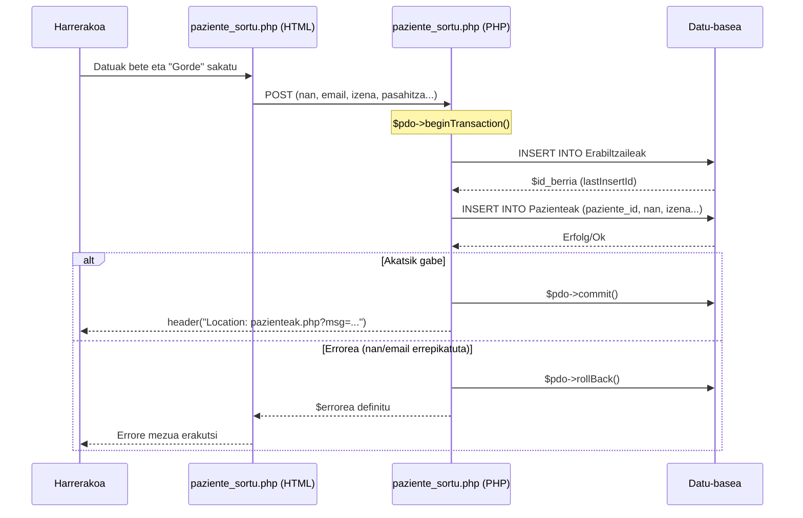

# 2. Erabiltzailea Sortu - Sekuentzia Diagrama

Harrerako langileak sisteman paziente berri bat erregistratzeko `paziente_sortu.php` fitxategiaren bidez jarraitzen duen fluxua.

## Partaideak:
*   **Harrerakoa:** Erregistro-inprimakia betetzen duen langilea.
*   **paziente_sortu.php (HTML):** Erregistro-inprimakia erakusten duen zatia.
*   **paziente_sortu.php (PHP):** Backend logika, transakzioak eta SQL exekuzioa kudeatzeko.
*   **Datu-basea:** `Erabiltzaileak` eta `Pazienteak` taulak.

## Urratsak (Gertaerak):
1.  **Harrerakoa -> paziente_sortu.php (HTML):** Datu guztiak sartu (NAN, emaila, izena, pasahitza, odol taldea, etab.) eta "Gorde Pazientea" sakatu.
2.  **paziente_sortu.php (HTML) -> paziente_sortu.php (PHP):** Datuak bidali `POST` metodoaren bidez.
3.  **paziente_sortu.php (PHP) -> Datu-basea:** Transakzio bat hasi. Testua: `$pdo->beginTransaction()`
4.  **paziente_sortu.php (PHP) -> Datu-basea (Erabiltzaileak):** Kontu orokorra sortu. Testua: `INSERT INTO Erabiltzaileak (email, pasahitza, rol_id, aktibo) VALUES (?, ?, 2, 1)`
5.  **paziente_sortu.php (PHP) -> Datu-basea:** Sortutako ID-a jaso. Testua: `$id_berria = $pdo->lastInsertId()`
6.  **paziente_sortu.php (PHP) -> Datu-basea (Pazienteak):** Pazientearen datu espezifikoak gordetzen dira. Testua: `INSERT INTO Pazienteak (paziente_id, nan, izena, abizenak, jaiotze_data, telefonoa, odol_taldea) VALUES (?, ?, ?, ?, ?, ?, ?)`
7.  **paziente_sortu.php (PHP) -> Datu-basea:** Transakzioa baieztatu. Testua: `$pdo->commit()`
8.  **paziente_sortu.php (PHP) -->> Harrerakoa:** Baieztapen mezua eta redirect-a orri nagusira. Testua: `header("Location: pazienteak.php?msg=...")`

**[Alt: Errorea txertatzean (Adibidez emaila edo NANa errepikatuta dagoelako)]**:
9.  **paziente_sortu.php (PHP) -> Datu-basea:** Transakzioa atzera bota. Testua: `$pdo->rollBack()`
10. **paziente_sortu.php (PHP) -->> Harrerakoa:** Errore mezua inprimatu formularioaren gainean.

---

## Ikuspegia (Mermaid)

