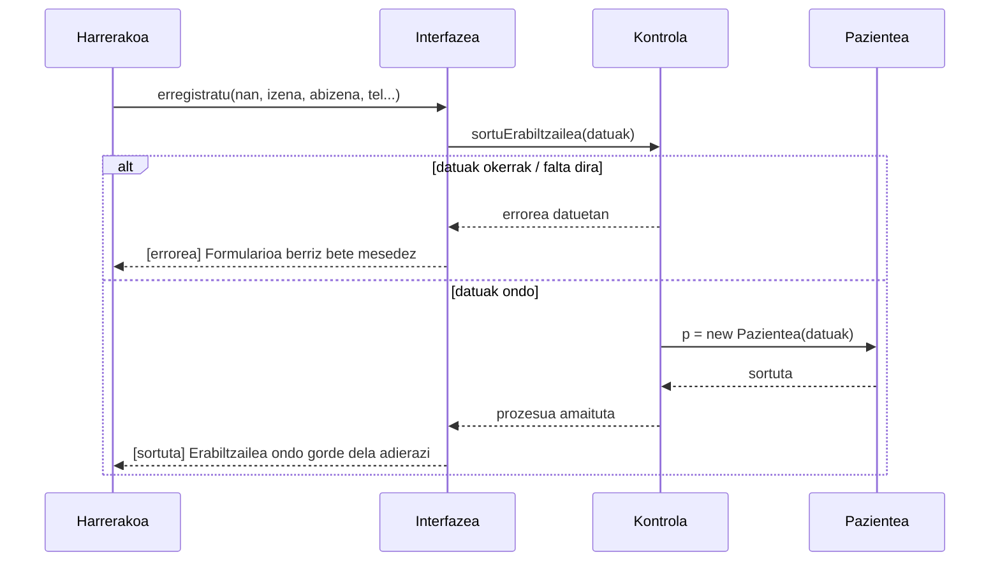

# 2. Erabiltzailea Sortu - Sekuentzia Diagrama

Sistemako langile batek (normalean Harrerakoak) erabiltzaile berri bat sistema barruan erregistratzean ematen den prozesua.

## Draw.io-n marrazteko elementuak (Zutabeak):
*   **Aktorea:** Harrerakoa (edo Administradorea)
*   **Muga / Interfazea:** Interfazea (Erregistro inprimakia)
*   **Kontrola:** Kontrola (Erabiltzaile sortzailea)
*   **Klasea:** Pazientea edo Medikua (dagokion klasea azpian sortuko da)

## Urratsak (Geziak) Draw.io-n irudikatzeko:
1.  **Harrerakoa -> Interfazea:** Bezeroaren/Medikuaren datu pertsonal guztiak idazten ditu eta "Gorde" botoiari ematen dio. Gezi testua: `erregistratu(datuak[])`
2.  **Interfazea -> Kontrola:** Funtzioa deitzen da. Gezi testua: `sortuErabiltzailea(datuak[])`

**[Alt: Datuak desegokiak badira]**:
3.  **Kontrola -> Interfazea** (Zatikako): Validazio errorea itzuli. Testua: `[ez baliozkoa] errorea`
4.  **Interfazea -> Harrerakoa** (Zatikako): Datuak berrikusteko eskatzen da.

**[Alt: Datuak baliozkoak badira]**:
5.  **Kontrola -> Klasea (Pazientea/Medikua):** Kontrolak instantzia berria sortzen du. Gezi mota: sorkuntza berria. Testua: `p = new Pazientea(nan, izena, email...)` edo `m = new Medikua(...)`
6.  **Klasea -> Kontrola** (Zatikako): Objektua sortu dela adierazi. Testua: `sortuta`
7.  **Kontrola -> Interfazea** (Zatikako): Sorkuntzaren baieztapena. Testua: `[sortuta] onartuta`
8.  **Interfazea -> Harrerakoa** (Zatikako): Erabiltzailea ondo txertatu den abisua pantailaratzen da. Testua: `Erabiltzaile berria erakutsi / Abisua onartu`

---

## Ikuspegia (Mermaid bidez)

