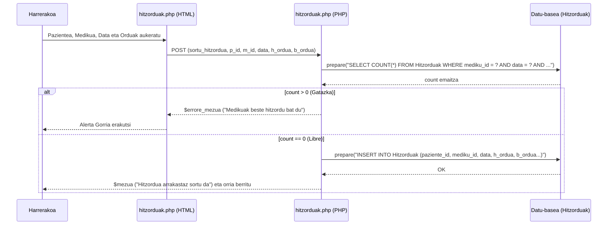

# 3. Hitzordua Hartu - Sekuentzia Diagrama

Hitzordu berri bat mediku espezifiko batekin gorde nahi denean `hitzorduak.php` fitxategian garatzen den fluxu ERREALA.

## Partaideak:
*   **Harrerakoa:** Erregistro-inprimakia betetzen duen langilea.
*   **hitzorduak.php (HTML):** Modala eta egutegia erakusten duen zatia.
*   **hitzorduak.php (PHP):** Backend logika, gatazkak egiaztatu eta SQL exekuzioa kudeatzeko.
*   **Datu-basea:** `Hitzorduak` taula.

## Urratsak (Gertaerak):
1.  **Harrerakoa -> hitzorduak.php (HTML):** Modala ireki ("+ Hitzordu Berria"), pazientea, medikua, data eta orduak (hasiera/bukaera) aukeratu eta "Gorde" sakatu.
2.  **hitzorduak.php (HTML) -> hitzorduak.php (PHP):** Datuak bidali `POST` metodoaren bidez (`sortu_hitzordua`).
3.  **hitzorduak.php (PHP) -> Datu-basea:** Medikua libre ote den begiratu. Kontsulta: `SELECT COUNT(*) FROM Hitzorduak WHERE mediku_id = ? AND data = ? AND ((hasiera_ordua < ? AND bukaera_ordua > ?) OR ...)`
4.  **Datu-basea -->> hitzorduak.php (PHP):** Zenbakia (count) itzuli.
5.  **hitzorduak.php (PHP):** Egiaztapena. Testua: `if (fetchColumn() == 0)`.

**[Alt: Medikuak ordutegia okupatuta badu (count > 0)]**:
6.  **hitzorduak.php (PHP) -->> hitzorduak.php (HTML):** Errore mezua definitu (`$errore_mezua`).
7.  **hitzorduak.php (HTML) -->> Harrerakoa:** Alerta gorria erakutsi modalean.

**[Alt: Ordu librea badago (count == 0)]**:
8.  **hitzorduak.php (PHP) -> Datu-basea:** Hitzordua gordetzen da. Kontsulta: `INSERT INTO Hitzorduak (paziente_id, mediku_id, data, hasiera_ordua, bukaera_ordua, arrazoia) VALUES (?, ?, ?, ?, ?, ?)`
9.  **Datu-basea -->> hitzorduak.php (PHP):** Baieztapena.
10. **hitzorduak.php (PHP) -->> Harrerakoa:** Baieztapen mezua eta orria berritzea. Testua: `$mezua = "Hitzordua arrakastaz sortu da."`

---

## Ikuspegia (Mermaid)

