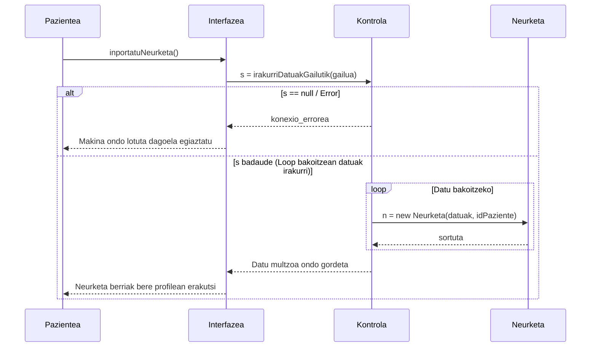

# 4. Neurketa Inportatu - Sekuentzia Diagrama

Pazienteak bihotz-maiztasuna, pisu edo arteria-presio makinetatik bluetooth/serie-ataka bidez jasotako datuak sisteman txertatzen ditu.

## Draw.io-n marrazteko elementuak (Zutabeak):
*   **Aktorea:** Pazientea
*   **Muga / Interfazea:** Interfazea (Sentsore/Neuro inportatzaile menua)
*   **Kontrola:** Kontrola (Datu iterazio/Neurketa analizatzailea)
*   **Klasea:** Neurketa (Neurketa instantzia eta datu base entitatea)

## Urratsak (Geziak) Draw.io-n irudikatzeko:
1.  **Pazientea -> Interfazea:** Beurer makina edo dagokion gailua konektatu eta botoia ematen dio. Testua: `ikertuDatuak()` / `inportatuNeurketa()`
2.  **Interfazea -> Kontrola:** Kontrolak gailuarekin konexioa bilatzen du edota emandako JSON/XML arraya irakurtzen du. Testua: `s = irakurriDatuakGailutik(gailua)`
3.  **Kontrola -> Kontrola** (Bere buruarekiko gezia iterazio baterako): Array oso bat ekarriz gero begizta egin (Loop). Testua: `For [data_each in s]`

4.  **Kontrola -> Neurketa (Klasea):** Prozesatutako datu bakoitzarekin egitura sortzen du DBn. Testua: `n = new Neurketa(balioa, data, id_paziente)`
5.  **Neurketa (Klasea) -> Kontrola** (Zatikako): `sortuta`

**[Alt: Gailuak emandako datuak hutsik badaude edo inkonexio errorea]**
6.  **Kontrola -> Interfazea** (Zatikako): `[s == null] errorea`
7.  **Interfazea -> Pazientea** (Zatikako): `Aparailurik entxufatu gabe / irakurri ezin idatziz ohartarazi`

**[Alt: Ondo doanean]**
8.  **Kontrola -> Interfazea** (Zatikako): `esportazioaEginda`
9.  **Interfazea -> Pazientea** (Zatikako): `Neuro datuak zerrendan gorde eta bistaratu`

---

## Ikuspegia (Mermaid bidez)

