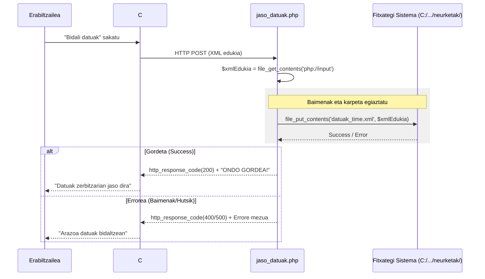

# 4. Neurketa Inportatu - Sekuentzia Diagrama

Pazienteak kanpoko gailu batetik (adibidez Beurer tensiometroa) datuak bidaltzen dituenean C# aplikazioaren bidez `jaso_datuak.php`-ra egiten den fluxu ERREALA.

## Partaideak:
*   **Erabiltzailea:** Neurketa egiten duen pazientea.
*   **C# Aplikazioa:** Gaitzailearen gailuaren datuak irakurri eta XML egitura bidaltzen duen softwarea.
*   **jaso_datuak.php:** Backend logika, XML datuak jaso eta fitxategi sisteman gordetzeko.
*   **Fitxategi Sistema:** `C:/Apache24-64/htdocs/neurketak/` karpeta.

## Urratsak (Gertaerak):
1.  **Erabiltzailea -> C# Aplikazioa:** Gailua konektatu eta "Bidali datuak" botoia sakatu.
2.  **C# Aplikazioa -> jaso_datuak.php:** `POST` eskaera bidali XML eduki osoarekin (`php://input`). Testua: `HTTP POST (XML edukia) headers: X-FILE-NAME`
3.  **jaso_datuak.php -> jaso_datuak.php:** Karpetaren existentzia eta idazteko baimenak egiaztatu. Testua: `file_exists()`, `mkdir()`, etc.
4.  **jaso_datuak.php -> jaso_datuak.php:** XML edukia irakurri. Testua: `$xmlEdukia = file_get_contents('php://input')`
5.  **jaso_datuak.php -> Fitxategi Sistema:** Fitxategia gordetzen da karpeta espezifikoan. Kontsulta: `file_put_contents($bideaOsoa, $xmlEdukia)`
6.  **Fitxategi Sistema -->> jaso_datuak.php:** Baieztapena (Byte kopurua itzuli).
7.  **jaso_datuak.php -->> C# Aplikazioa:** HTTP erantzuna (200 OK edo 500 Errorea). Testua: `http_response_code(200); echo "ONDO GORDEA!"`
8.  **C# Aplikazioa -->> Erabiltzailea:** Datuak zerbitzarian ondo gorde direla adierazi pantailan.

---

## Ikuspegia (Mermaid)

