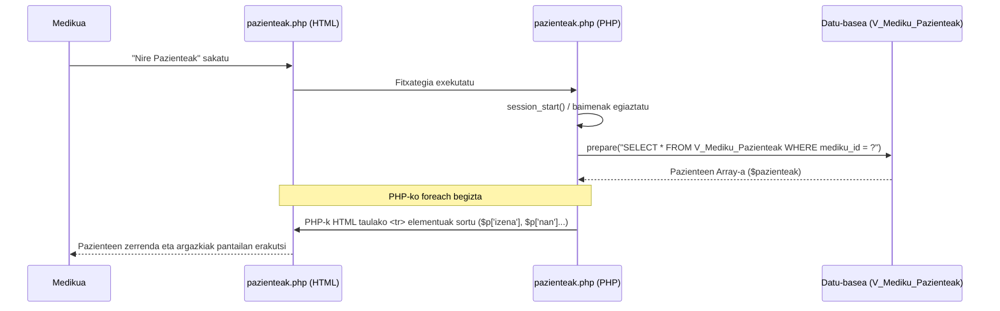

# 5. Paziente Zerrenda Ikusi - Sekuentzia Diagrama

Medikuak saioa hasita duela, bere kargura dauden pazienteen zerrenda kontsultatzeko `pazienteak.php` fitxategian garatzen den fluxu ERREALA.

## Partaideak:
*   **Medikua:** Bere pazienteak ikusi nahi dituen langilea.
*   **pazienteak.php (HTML):** Taula eta inprimakiak erakusten dituen zatia.
*   **pazienteak.php (PHP):** Backend logika, saioa egiaztatu eta SQL exekuzioa kudeatzeko.
*   **Datu-basea (V_Mediku_Pazienteak):** Mediku eta pazienteen arteko loturak kudeatzen dituen bista.

## Urratsak (Gertaerak):
1.  **Medikua -> pazienteak.php (HTML):** Medikuaren menuko "Nire Pazienteak" botoian klik egin.
2.  **pazienteak.php (HTML) -> pazienteak.php (PHP):** Eskaera zerbitzarira bidali.
3.  **pazienteak.php (PHP) -> pazienteak.php (PHP):** Saioa hasita dagoela eta rola zuzena dela egiaztatu. Testua: `session_start()`, `$_SESSION['rol_izena'] === 'Medikua'`
4.  **pazienteak.php (PHP) -> Datu-basea:** Mediku horri esleitutako pazienteak bilatu. Kontsulta: `SELECT * FROM V_Mediku_Pazienteak WHERE mediku_id = ?`
5.  **Datu-basea -->> pazienteak.php (PHP):** Pazienteen zerrenda (Array) itzuli. Testua: `$pazienteak = $stmt->fetchAll()`
6.  **pazienteak.php (PHP) -> pazienteak.php (HTML):** Datu-taula dinamikoki sortzen da. Testua: `foreach ($pazienteak as $p)` loop-a eta `<tr>` tag-ak txertatu.
7.  **pazienteak.php (HTML) -->> Medikua:** Pazienteen argazkiak, NAN, izena eta telefonoa erakusten dituen taula pantailaratzen da.

---

## Ikuspegia (Mermaid)

